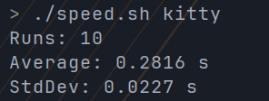

# Terminal Spawn Speed

I spend most of my time launching and closing terminals around the system. So it's useful to know how much it take to launch and close it.

## Test

With `time` and `bash` its easy to check.

```bash
time kitty -- sh -c "exit"
time alacritty -e sh -c "exit"
time st -e sh -c "exit"
time urxvtc -e sh -c "exit"
```

## Results

`kitty` goes around 0.27-0.30 seconds



`alacritty` goes around 0.15-0.17 seconds


`st` goes around 0.051-0.055 seconds


`urxvt` with the daemon(`urxvtd` and `urxvtc`) goes around 0.010 seconds


The fastest terminal is `urxvt` with the daemon `urxvtd`.

## Script

To test with different terminals use the [speed.sh](speed.sh) script.
